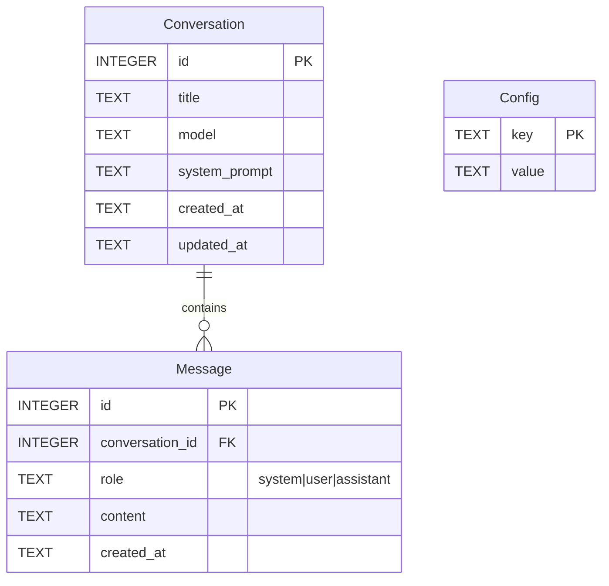
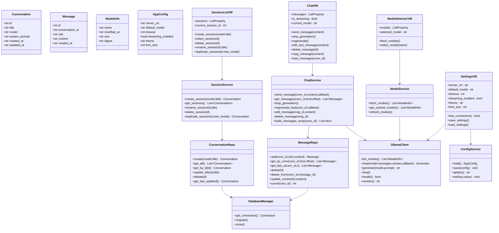
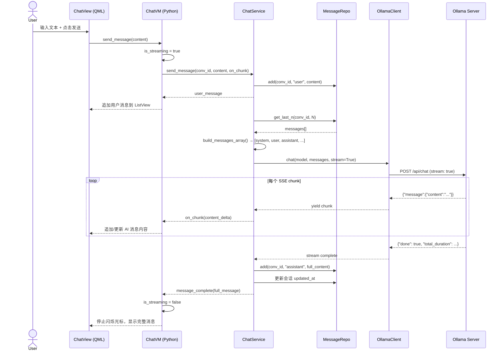
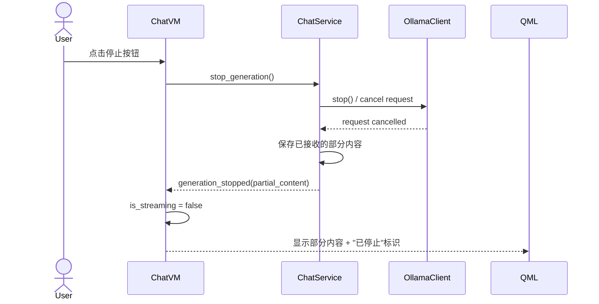
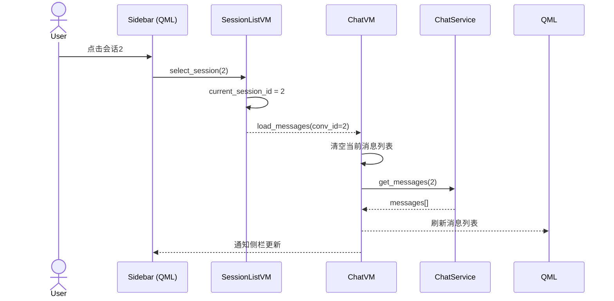

# RemoteOllama - 跨平台 AI 聊天客户端设计文档

## 阶段 2：总体架构设计

```
┌──────────────────────────────────────────────────────────────────────┐
│                          UI Layer (QML)                              │
│  ┌──────────┐  ┌──────────┐  ┌──────────┐  ┌──────────────────┐    │
│  │ Sidebar  │  │ ChatView │  │ Settings │  │ ModelSelector    │    │
│  │ (会话列表)│  │ (聊天区域)│  │ (设置页) │  │ (模型选择)       │    │
│  └────┬─────┘  └────┬─────┘  └────┬─────┘  └────────┬─────────┘    │
├───────┼──────────────┼─────────────┼─────────────────┼──────────────┤
│       │         ViewModel Layer (QObject)             │              │
│  ┌────┴─────┐  ┌────┴─────┐  ┌────┴─────┐  ┌────────┴─────────┐    │
│  │SessionVM │  │ ChatVM   │  │ConfigVM  │  │   ModelVM        │    │
│  │(会话管理) │  │(聊天逻辑) │  │(配置管理) │  │   (模型管理)     │    │
│  └────┬─────┘  └────┬─────┘  └────┬─────┘  └────────┬─────────┘    │
├───────┼──────────────┼─────────────┼─────────────────┼──────────────┤
│       │           Service Layer (Pure Python)         │              │
│  ┌────┴─────┐  ┌────┴─────┐  ┌────┴─────┐  ┌────────┴─────────┐    │
│  │SessionSvc│  │ ChatSvc  │  │ConfigSvc │  │   ModelSvc       │    │
│  │(会话CRUD)│  │(消息管理) │  │(配置读写) │  │   (模型拉取)     │    │
│  └────┬─────┘  └────┬─────┘  └────┬─────┘  └────────┬─────────┘    │
├───────┼──────────────┼─────────────┼─────────────────┼──────────────┤
│       │          Data Layer                                   │      │
│  ┌────┴─────────────────────────────┐  ┌────────────────────┴───┐  │
│  │        DatabaseManager           │  │    OllamaClient        │  │
│  │   (SQLite: CRUD + Migrations)    │  │ (HTTP API 封装)        │  │
│  └──────────────────────────────────┘  └────────────────────────┘  │
└──────────────────────────────────────────────────────────────────────┘
```

### 数据流方向

```
用户输入 → QML → ViewModel(信号/槽) → Service → OllamaClient(HTTP POST /api/chat)
                                                      ↓
用户看到 ← QML ← ViewModel(属性绑定) ← Service ← 流式chunk逐条yield
```

### 核心设计原则

- **单向数据流**: ViewModel 持有状态，UI 通过属性绑定单向消费
- **异步优先**: 所有网络请求通过 QThread + signals 或 asyncio 实现非阻塞
- **分层清晰**: 每层只依赖下层，不允许跨层调用
- **依赖注入**: Service 和 Client 通过构造函数注入，便于测试

---

## 阶段 3：项目目录结构

```
RemoteOllama/
├── app/
│   ├── main.py                  # 应用入口，QApplication 初始化
│   ├── models/                  # 数据类（纯数据，无业务逻辑）
│   │   ├── __init__.py
│   │   ├── conversation.py      # Conversation dataclass
│   │   ├── message.py           # Message dataclass
│   │   ├── model_info.py        # ModelInfo dataclass
│   │   └── app_config.py        # AppConfig dataclass
│   ├── database/                # 数据库层
│   │   ├── __init__.py
│   │   ├── db_manager.py        # SQLite 连接管理 + 迁移
│   │   ├── conversation_repo.py # 会话表 CRUD
│   │   └── message_repo.py      # 消息表 CRUD
│   ├── services/                # 业务逻辑层
│   │   ├── __init__.py
│   │   ├── ollama_client.py     # HTTP API 封装（核心）
│   │   ├── session_service.py   # 会话管理业务逻辑
│   │   ├── chat_service.py      # 聊天业务逻辑（流式）
│   │   ├── model_service.py     # 模型列表管理
│   │   └── config_service.py    # 配置读写
│   ├── viewmodels/              # ViewModel 层（QObject）
│   │   ├── __init__.py
│   │   ├── session_list_vm.py   # 会话列表 VM
│   │   ├── chat_vm.py           # 聊天界面 VM（核心）
│   │   ├── settings_vm.py       # 设置页 VM
│   │   └── model_selector_vm.py # 模型选择 VM
│   ├── ui/                      # UI 层
│   │   ├── __init__.py
│   │   ├── app_window.py        # 主窗口管理
│   │   └── qml_bridge.py        # QML ↔ Python 桥接注册
│   ├── utils/                   # 工具函数
│   │   ├── __init__.py
│   │   ├── logger.py            # 统一日志
│   │   ├── markdown.py          # Markdown → HTML 转换
│   │   └── constants.py         # 常量定义
│   ├── config/                  # 配置管理
│   │   ├── __init__.py
│   │   ├── config_manager.py    # config.json 读写
│   │   └── defaults.py          # 默认配置值
│   └── resources/               # 静态资源
│       ├── icons/               # SVG 图标
│       ├── qml/                 # QML 文件
│       │   ├── MainWindow.qml   # 主窗口布局
│       │   ├── Sidebar.qml      # 左侧会话列表
│       │   ├── ChatView.qml     # 聊天区域
│       │   ├── MessageBubble.qml# 消息气泡
│       │   ├── InputArea.qml    # 输入区域
│       │   ├── SettingsPage.qml # 设置页
│       │   └── Theme.qml        # 主题定义
│       └── fonts/               # 字体文件
├── tests/                       # 测试
│   ├── __init__.py
│   ├── test_ollama_client.py
│   ├── test_session_service.py
│   ├── test_chat_service.py
│   └── test_db_manager.py
├── requirements.txt             # Python 依赖
├── config.json                  # 运行时配置
├── prompt.md                    # 项目需求
└── DESIGN.md                    # 本设计文档
```

### 各目录职责

| 目录 | 职责 | 依赖 |
|------|------|------|
| `models/` | 纯数据结构定义，dataclass，无逻辑 | 无 |
| `database/` | SQLite CRUD，连接管理，迁移 | models |
| `services/` | 业务逻辑编排，调用 database 和 ollama_client | models, database |
| `viewmodels/` | QObject 子类，属性绑定，信号发射，调用 service | models, services |
| `ui/` | QML 文件加载，Python-QML 桥接 | viewmodels, resources/qml |
| `utils/` | 横切工具：日志/markdown/常量 | 无 |
| `config/` | 配置文件的读写和默认值 | utils |
| `resources/` | QML、图标、字体等静态资源 | 无 |

---

## 阶段 4：数据库设计

### ER 图 (Mermaid)



### 表结构 SQL

```sql
CREATE TABLE IF NOT EXISTS conversation (
    id            INTEGER PRIMARY KEY AUTOINCREMENT,
    title         TEXT    NOT NULL DEFAULT 'New Chat',
    model         TEXT    NOT NULL DEFAULT '',
    system_prompt TEXT    DEFAULT '',
    created_at    TEXT    NOT NULL DEFAULT (datetime('now')),
    updated_at    TEXT    NOT NULL DEFAULT (datetime('now'))
);

CREATE TABLE IF NOT EXISTS message (
    id              INTEGER PRIMARY KEY AUTOINCREMENT,
    conversation_id INTEGER NOT NULL,
    role            TEXT    NOT NULL CHECK(role IN ('system','user','assistant')),
    content         TEXT    NOT NULL DEFAULT '',
    created_at      TEXT    NOT NULL DEFAULT (datetime('now')),
    FOREIGN KEY (conversation_id) REFERENCES conversation(id) ON DELETE CASCADE
);

CREATE TABLE IF NOT EXISTS config (
    key   TEXT PRIMARY KEY,
    value TEXT NOT NULL DEFAULT ''
);

CREATE INDEX IF NOT EXISTS idx_message_conv ON message(conversation_id);
CREATE INDEX IF NOT EXISTS idx_message_time ON message(created_at);
```

### 设计说明

- `conversation.title`: 由第一条用户消息的前50字符自动生成
- `conversation.model`: 存储模型名称，来自 `GET /api/tags` 返回值
- `conversation.system_prompt`: 每个会话可自定义 System Prompt
- `message.role`: 约束为 `system|user|assistant`，对应 Ollama API 的 messages 数组
- `config`: key-value 存储，存放服务器地址、超时等全局配置
- `ON DELETE CASCADE`: 删除会话自动清理其所有消息
- 索引：按会话ID和时间建立索引，加速消息加载

---

## 阶段 5：UI 设计

### 页面结构与组件关系

```
AppWindow (QML ApplicationWindow)
├── Sidebar (左侧栏,宽度 260dp)
│   ├── IconButton("+ 新建聊天")          → 触发 SessionVM.create()
│   ├── ListView (会话列表)              → 绑定 SessionVM.sessions
│   │   └── SessionItem (单个会话)        → 点击切换，长按菜单
│   │       ├── Text(title)
│   │       ├── Text(model)
│   │       └── Text(updated_at)
│   ├── Spacer
│   └── IconButton("设置")               → 切换到设置页
│
├── StackLayout (右侧主区域)
│   ├── ChatPage (聊天页, 默认)
│   │   ├── TopBar (顶栏)
│   │   │   ├── Text(当前会话标题)
│   │   │   ├── ModelBadge(模型名)
│   │   │   └── IconButton("⋮ 更多")
│   │   ├── ScrollView (消息列表)
│   │   │   └── ListView → MessageBubble (每条消息)
│   │   │       ├── Avatar (用户/AI头像)
│   │   │       ├── MarkdownText (消息内容, Markdown渲染)
│   │   │       └── ActionRow (复制/重新生成/删除)
│   │   ├── InputArea (底部输入区)
│   │   │   ├── TextArea (多行输入)
│   │   │   ├── IconButton("停止")        → 仅生成中显示
│   │   │   └── IconButton("发送")
│   │   └── EmptyState (无会话时的引导)
│   │
│   └── SettingsPage (设置页)
│       ├── ServerSettings
│       │   ├── TextField(服务器地址)
│       │   └── Button("测试连接")
│       ├── DefaultModel
│       │   └── ComboBox(模型列表)
│       ├── AppearanceSettings
│       │   ├── Switch(深色/浅色主题)
│       │   └── Slider(字体大小)
│       └── ChatSettings
│           ├── Switch(启用Streaming)
│           └── SpinBox(超时时间)
│
├── ModelSelectorDialog (弹窗)
│   ├── ListView(可用模型列表,来自 /api/tags)
│   └── Button("确认")
│
└── Toast/SnackBar (底部提示, 短暂显示)
```

### 主题系统

```qml
// Theme.qml - 通过 QtObject 暴露颜色和字体
pragma Singleton

QtObject {
    property bool isDark: true

    // 主题色板
    property color primaryColor: "#10A37F"     // ChatGPT 绿
    property color bgPrimary: isDark ? "#1E1E2E" : "#FFFFFF"
    property color bgSecondary: isDark ? "#2D2D3F" : "#F7F7F8"
    property color bgBubbleUser: isDark ? "#2D2D3F" : "#F0F0F0"
    property color bgBubbleAI: isDark ? "#1E1E2E" : "#FFFFFF"
    property color textPrimary: isDark ? "#ECECF1" : "#1A1A2E"
    property color textSecondary: isDark ? "#9B9BB3" : "#6E6E80"
    property color borderColor: isDark ? "#3E3E55" : "#E5E5E5"

    property int fontSizeSmall: 12
    property int fontSizeNormal: 14
    property int fontSizeLarge: 16
    property int fontSizeTitle: 18
}
```

### DPI 自适应

```qml
// 使用 Screen.devicePixelRatio 自动计算
readonly property real dp: Screen.devicePixelRatio
// 所有尺寸使用 `* dp` 缩放
```

---

## 阶段 6：类图 (Mermaid)



---

## 阶段 7：核心时序图 (Mermaid)

### 7.1 发送消息 + 流式接收



### 7.2 停止生成



### 7.3 切换会话



---

## 阶段 8：模块依赖关系

```
┌──────────────────────────────────────────────────────────────┐
│                        app/main.py                           │
│                   (入口：创建 QApplication)                    │
└──────────┬──────────┬──────────┬──────────┬──────────────────┘
           │          │          │          │
    ┌──────▼───┐ ┌───▼────┐ ┌───▼────┐ ┌───▼─────┐
    │ viewmodels│ │config/ │ │utils/  │ │database/ │
    └──────┬───┘ └───┬────┘ └───┬────┘ └────┬─────┘
           │         │         │           │
    ┌──────▼───┐     │         │    ┌──────▼─────┐
    │ services │     │         │    │ database/  │
    └──────┬───┘     │         │    │ models/    │
           │         │         │    └────────────┘
    ┌──────▼───┐     │         │
    │ models/  │     │         │
    └──────────┘     │         │
                     │         │
              ┌──────▼───┐     │
              │ config/  │     │
              │ utils/   │     │
              └──────────┘     │
                         ┌─────▼──────┐
                         │ resources/ │
                         │  ui/       │
                         └────────────┘
```

### 依赖规则

| 层级 | 可以依赖 | 禁止依赖 |
|------|---------|---------|
| **UI (QML)** | viewmodels (通过属性绑定) | services, database, models |
| **ViewModels** | services, models, utils | database |
| **Services** | models, database, utils, config | viewmodels |
| **Database** | models, utils | services, viewmodels |
| **Models** | 无 | 所有 |
| **Utils/Config** | 无 | 所有 |

---

## 阶段 9：核心 API 封装设计

基于 Ollama 官方 API，`OllamaClient` 封装如下：

| 方法 | HTTP 请求 | 说明 |
|------|----------|------|
| `list_models()` | `GET /api/tags` | 获取可用模型列表 |
| `chat(model, messages, stream, on_chunk)` | `POST /api/chat` | 聊天（支持流式） |
| `generate(model, prompt)` | `POST /api/generate` | 单次生成（非流式备选） |
| `health()` | `GET /` | 检查服务器是否可达 |
| `version()` | `GET /api/version` | 获取 Ollama 版本 |
| `show(model)` | `POST /api/show` | 获取模型详情 |

### 请求格式 (chat)

```python
# POST /api/chat
payload = {
    "model": "qwen3",
    "messages": [
        {"role": "system", "content": "You are helpful."},
        {"role": "user", "content": "Hello!"},
        {"role": "assistant", "content": "Hi! How can I help?"},
        {"role": "user", "content": "What is Python?"}
    ],
    "stream": True,
    "options": {
        "temperature": 0.7,
        "num_predict": 4096
    }
}
```

### 流式响应解析

```python
# 每个 SSE chunk 格式 (JSON Lines)
{"model":"qwen3","created_at":"...","message":{"role":"assistant","content":"Python"},"done":false}
{"model":"qwen3","created_at":"...","message":{"role":"assistant","content":" is"},"done":false}
...
{"model":"qwen3","created_at":"...","message":{"role":"assistant","content":""},"done":true,"total_duration":...}
```

---

## 阶段 10：状态管理设计

### 状态分类

| 状态类型 | 持有者 | 生命周期 | 示例 |
|---------|--------|---------|------|
| **UI 状态** | QML 自身 | 页面级 | 滚动位置、输入框文本 |
| **视图状态** | ViewModel (QObject Property) | 应用级 | 当前会话ID、消息列表 |
| **业务状态** | Service (单例) | 应用级 | 可用模型缓存 |
| **持久状态** | SQLite / config.json | 永久 | 消息记录、配置 |

### ViewModel 属性绑定机制

```python
class ChatVM(QObject):
    # Qt Property → QML 自动双向绑定
    messages_changed = Signal()
    streaming_changed = Signal()
    error_occurred = Signal(str)

    @Property('QVariantList', notify=messages_changed)
    def messages(self): ...

    @Property(bool, notify=streaming_changed)
    def is_streaming(self): ...
```

### QML 绑定

```qml
ListView {
    model: chatVM.messages               // 自动随 Python 属性变化
}
Button {
    visible: chatVM.is_streaming         // 流式时显示停止按钮
    onClicked: chatVM.stop_generation()
}
```

---

## 阶段 11：多会话实现方案

### 数据结构

```
SQLite: conversation 表
┌────┬───────────┬──────────┬─────────────────────┐
│ id │ title     │ model    │ updated_at          │
├────┼───────────┼──────────┼─────────────────────┤
│ 1  │ Python问题 │ qwen3    │ 2026-07-28 10:30:00 │
│ 2  │ 翻译助手   │ llama3   │ 2026-07-28 10:25:00 │
│ 3  │ 代码审查   │ deepseek │ 2026-07-28 10:20:00 │
└────┴───────────┴──────────┴─────────────────────┘
```

### 交互流程

1. **新建会话**: 点击 "+" → 弹出模型选择器 → 选择模型 → 创建 conversation 记录 → 自动切换到新会话
2. **切换会话**: 点击侧栏会话项 → `SessionListVM.select_session(id)` → `ChatVM.load_messages(id)` → ListView 刷新
3. **删除会话**: 长按/右键 → 确认对话框 → `DELETE CASCADE` 删除会话和所有消息
4. **重命名**: 双击标题 → 行内编辑 → `update_title(id, new_title)`
5. **复制会话**: 右键菜单 → 选择新模型 → 复制消息到新会话 → 切换

### title 自动生成规则

```python
def auto_title(first_user_message: str) -> str:
    """取第一条用户消息的前50字符作为标题，去除换行"""
    cleaned = first_user_message.strip().replace('\n', ' ')[:50]
    return cleaned if cleaned else "New Chat"
```

---

## 阶段 12：多模型实现方案

### 模型数据流

```
                    ┌──────────────────┐
用户点击模型选择器    │  ModelService    │
──────────────────►│  fetch_models()  │
                    └────────┬─────────┘
                             │ HTTP GET /api/tags
                             ▼
                    ┌──────────────────┐
                    │  OllamaClient    │
                    │  list_models()   │
                    └────────┬─────────┘
                             │
                             ▼
                    ┌──────────────────┐
                    │ Ollama Server    │
                    │ 返回模型列表 JSON  │
                    └────────┬─────────┘
                             │
                             ▼
              ┌──────────────────────────┐
              │ {                        │
              │   "models": [            │
              │     {"name": "qwen3:14b",│
              │      "size": 8544883829, │
              │      "digest": "abc...", │
              │      ...},               │
              │     {"name": "llama3:8b",│
              │      ...}                │
              │   ]                      │
              │ }                        │
              └──────────┬───────────────┘
                         │
                         ▼
              ┌──────────────────────────┐
              │ ModelSelectorVM.models   │
              │ → QML ComboBox/ListView  │
              │ 用户选择 → 存入会话      │
              └──────────────────────────┘
```

### 约束规则

- 一个会话 = 一个模型（创建时确定，存储于 `conversation.model`）
- 切换模型 = 复制聊天到新会话（消息继承，model 更新）
- 聊天中不可中途切换模型
- 每个请求携带完整的 `messages` 数组 + 对应 `model` 字段

---

## 阶段 13：Streaming 实现方案

### 技术选型：QThread + Signal

```python
class StreamWorker(QThread):
    """在子线程中执行流式HTTP请求，通过信号逐chunk发回"""
    chunk_received = Signal(str)       # 每个 token
    stream_finished = Signal(str)      # 完整内容
    stream_error = Signal(str)         # 错误信息

    def __init__(self, client, model, messages):
        super().__init__()
        self.client = client
        self.model = model
        self.messages = messages

    def run(self):
        try:
            full = []
            for chunk in self.client.chat(self.model, self.messages, stream=True):
                # chunk 格式: {"message": {"content": "token"}}
                content = chunk.get("message", {}).get("content", "")
                if content:
                    full.append(content)
                    self.chunk_received.emit(content)
            self.stream_finished.emit("".join(full))
        except Exception as e:
            self.stream_error.emit(str(e))
```

### 在 ChatVM 中组装

```python
def send_message(self, content: str):
    # 1. 保存用户消息到 DB
    user_msg = self.chat_service.save_user_message(self.conv_id, content)
    self._append_to_list(user_msg)

    # 2. 构建完整 messages 数组
    messages = self.chat_service.build_messages_array(self.conv_id)

    # 3. 创建 AI 消息占位
    ai_placeholder = Message(role="assistant", content="")
    self._append_to_list(ai_placeholder)

    # 4. 启动流式 Worker
    self.worker = StreamWorker(self.client, self.current_model, messages)
    self.worker.chunk_received.connect(self._on_chunk)
    self.worker.stream_finished.connect(self._on_stream_finished)
    self.worker.stream_error.connect(self._on_stream_error)
    self.worker.start()
```

### 停止生成

```python
def stop_generation(self):
    if self.worker and self.worker.isRunning():
        # 1. 发送 HTTP 取消请求 (关闭连接)
        self.client.cancel_current_request()
        # 2. 等待线程结束
        self.worker.quit()
        self.worker.wait(1000)
    # 3. 保存已接收的部分内容
    partial = self._get_current_ai_content()
    self.chat_service.save_assistant_message(self.conv_id, partial)
    self.is_streaming = False
```

---

## 阶段 14：Android 打包方案

### 推荐方案：python-for-android (p4a) + Buildozer

```
┌─────────────────────────────────────┐
│            buildozer.spec           │
│  (配置文件：包名/权限/依赖/图标...)    │
└──────────────┬──────────────────────┘
               │
               ▼
┌─────────────────────────────────────┐
│     python-for-android (p4a)        │
│  ┌───────────────────────────────┐  │
│  │ Python 3.11 + PySide6         │  │
│  │ + httpx + sqlite3 + ...       │  │
│  └───────────────────────────────┘  │
│  ┌───────────────────────────────┐  │
│  │ Qt for Android (Qt 6.x)       │  │
│  └───────────────────────────────┘  │
└──────────────┬──────────────────────┘
               │
               ▼
┌─────────────────────────────────────┐
│         APK / AAB 输出              │
│    RemoteOllama-v1.0.0-release.apk  │
└─────────────────────────────────────┘
```

### Android 适配要点

| 项目 | 处理方式 |
|------|---------|
| **权限** | `<uses-permission android:name="android.permission.INTERNET"/>` + 明文HTTP配置 |
| **网络** | `android:usesCleartextTraffic="true"` (Ollama 通常走 HTTP) |
| **DPI** | QML 使用 `Screen.devicePixelRatio` 自动缩放 |
| **返回键** | 重写 `Keys.onBackPressed`: 在设置页返回聊天，在聊天页退出应用 |
| **横竖屏** | `AndroidManifest.xml` 允许旋转，QML 使用响应式布局 |
| **键盘** | 输入框获焦时自动上移，使用 `Qt.inputMethod.visibleRectangle` |

### buildozer.spec 关键配置

```ini
[app]
package.name = remoteollama
package.domain = com.example
source.dir = app
requirements = python3,pyside6,httpx,sqlite3,markdown
permissions = INTERNET
android.uses_cleartext_traffic = True
android.api = 33
android.minapi = 26
p4a.branch = develop
```

---

## 阶段 15：Windows/Linux 发布方案

### Windows：PyInstaller

```bash
# 打包为单个 .exe
pyinstaller --name RemoteOllama \
    --windowed \
    --onefile \
    --icon=app/resources/icons/app.ico \
    --add-data="app/resources:resources" \
    --hidden-import=PySide6.QtQml \
    --hidden-import=PySide6.QtQuick \
    app/main.py

# 输出: dist/RemoteOllama.exe
```

### Linux：PyInstaller + AppImage

```bash
# 1. PyInstaller 打包
pyinstaller --name RemoteOllama \
    --windowed \
    --onefile \
    --add-data="app/resources:resources" \
    app/main.py

# 2. 创建 AppDir 结构
mkdir -p AppDir/usr/bin
cp dist/RemoteOllama AppDir/usr/bin/

# 3. 用 linuxdeployqt 补全 Qt 依赖
linuxdeployqt AppDir/usr/share/applications/remoteollama.desktop

# 4. 生成 AppImage
appimagetool AppDir RemoteOllama-x86_64.AppImage
```

### 版本发布矩阵

| 平台 | 格式 | 安装方式 |
|------|------|---------|
| Windows 10/11 | `.exe` (PyInstaller) | 双击运行 / 安装包 |
| Linux (Ubuntu/Debian) | `.AppImage` / `.deb` | 赋予执行权限运行 |
| Linux (Fedora/Arch) | `.AppImage` | 同上 |
| Android | `.apk` / `.aab` | 侧载 / Google Play |

---

## 阶段 16：开发计划

| 阶段 | 内容 | 预计文件 | 状态 |
|------|------|---------|------|
| **P0: 基础设施** | models, database, config, utils, logger | 12个 | 待开始 |
| **P1: API 封装** | OllamaClient + 测试 | 2个 | 待开始 |
| **P2: 服务层** | SessionService, ChatService, ModelService, ConfigService | 4个 | 待开始 |
| **P3: ViewModel** | SessionListVM, ChatVM, SettingsVM, ModelSelectorVM | 4个 | 待开始 |
| **P4: UI (QML)** | 主窗口、侧栏、聊天区、消息气泡、输入区、设置页、主题 | 7个 | 待开始 |
| **P5: 集成** | main.py, QML-Python 桥接 | 2个 | 待开始 |
| **P6: 测试** | 单元测试 + 集成测试 | 4个 | 待开始 |
| **P7: 打包** | Windows/Linux/Android 打包配置 | 3个 | 待开始 |

---

> **说明**: 阶段 17（代码生成）将按 P0-P7 顺序逐步实现，每阶段输出完整可运行代码。
